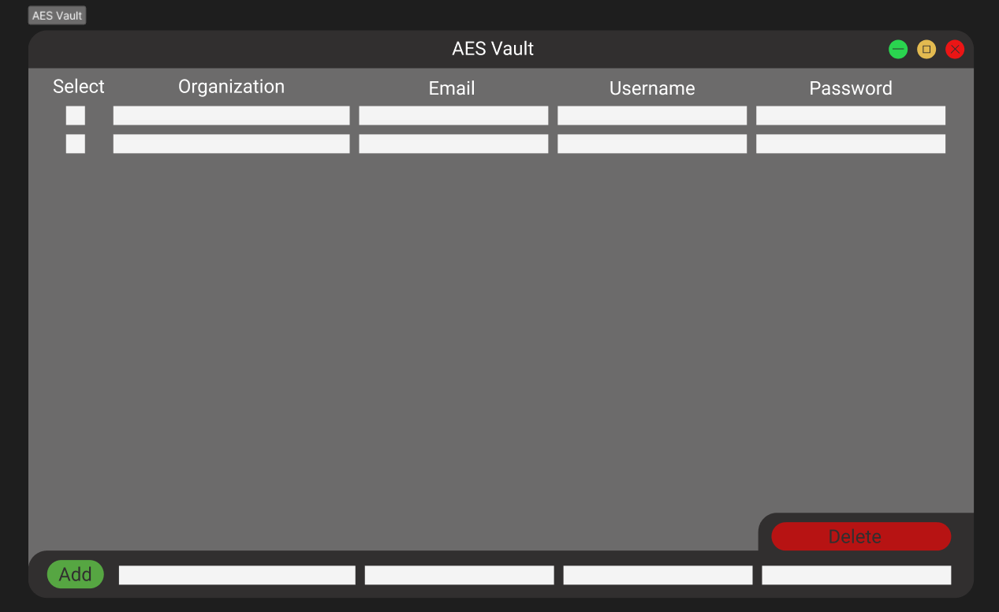

# AESVault -- A Password Storage Desktop App
## Goal
The goal of this project is to learn more about symmetric encryption and further practice C++ skills.

## Encryption.cpp/Encryption.h
These files hold the completed AES-128 bit algorithm. 

## Entry.cpp/Entry.h
These files hold the class used to access and manage the data from the database.

## Main.cpp
Uses Entry and Encryption files to encrypt, store, and access user and lets users specify AES key.

## Final Product Design
