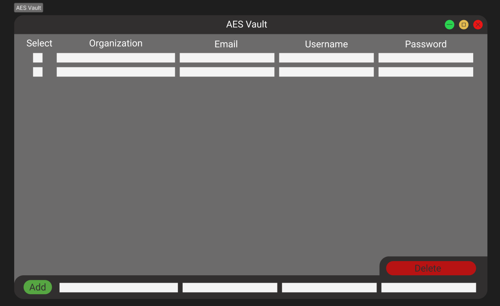

# AESVault - A Password Storage Desktop App
## Goal
The Goal of this project is to learn more about symmetric encryption, hashing, and GUI development and practice C++ skills.

### Encryption.cpp/Encryption.h
These files hold the completed AES-128 bit algorithm. 

### Hash.cpp/Hash.h
These files hold the completed SHA-256 hashing algorithm.

### Store.cpp/Store.h
These files hold the functions to query the SQLite database.

### App.cpp
Uses functions to encrypt, store, and access user credentials through a wxWidgets GUI.

## Todo
-Need to replace my Sqlite functions with the integrated wxWidgets Sqlite functions.
-Need to add salt to my hashes.
-Need to implement anti-bruteforce methods.
-Need to add table and another tab in the GUI to keep track of database changes.

## Final Product Design
